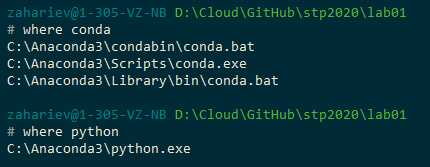
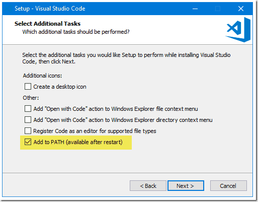

# “Современные технологии программирования” <br/> Настройка окуржения разработчика <br/> на овнове связки "Anaconda" + "Visual Studio Code"

## Anaconda

[**"Anaconda"**](https://ru.wikipedia.org/wiki/Anaconda_(%D0%B4%D0%B8%D1%81%D1%82%D1%80%D0%B8%D0%B1%D1%83%D1%82%D0%B8%D0%B2_Python)) — дистрибутив языков программирования Python, включающий набор популярных свободных библиотек, объединённых проблематиками науки о данных и машинного обучения. 

Основная цель — поставка единым согласованным комплектом наиболее востребованных соответствующим кругом пользователей тематических модулей (таких как NumPy, SciPy, Astropy и других) с разрешением возникающих зависимостей и конфликтов, которые неизбежны при одиночной установке.


Основная особенность дистрибутива — оригинальный [менеджер управления зависимостями](https://ru.wikipedia.org/wiki/%D0%A1%D0%B8%D1%81%D1%82%D0%B5%D0%BC%D0%B0_%D1%83%D0%BF%D1%80%D0%B0%D0%B2%D0%BB%D0%B5%D0%BD%D0%B8%D1%8F_%D0%BF%D0%B0%D0%BA%D0%B5%D1%82%D0%B0%D0%BC%D0%B8) "conda" с графическим интерфейсом Anaconda Navigator, что позволяет отказаться от (или использовать своместно) стандартных менеджеров пакетов, например, "pip". 

Основная особенность дистрибутива — оригинальный менеджер разрешения зависимостей conda с графическим интерфейсом Anaconda Navigator, что позволяет отказаться от стандартных менеджеров пакетов (таких, как pip для Python). Дистрибутив скачивается единожды (вместе с широким рядом популярных модулей), и вся последующая конфигурация, в том числе установка дополнительных модулей, может проводиться в офлайне.

Кроме того, обеспечивается возможность ведения нескольких изолированных сред (виртуальных окружений) с раздельным разрешением версионных зависимостей в каждой, наподобие утилит "venv", "pyenv" и т.д.

Кроме полной версии дистрибутива "Anaconda" , есть ещё облегчённый вариант дистрибутива под названием "miniconda". Разница в том, что miniconda просто отправляет систему управления репозиториями. Поэтому, когда вы устанавливаете его, есть только система управления без пакетов. В то время как с Anaconda это похоже на дистрибутив с некоторыми встроенными пакетами. ... Если вы решите обновить Anaconda, вы обновляете всю систему.

## Visual Studio Code

[**"Visual Studio Code"**](https://ru.wikipedia.org/wiki/Visual_Studio_Code) — редактор исходного кода, разработанный Microsoft для Windows, Linux и macOS. Позиционируется как «лёгкий» редактор кода для кроссплатформенной разработки веб- и облачных приложений. Включает в себя отладчик, инструменты для работы с Git, подсветку синтаксиса, IntelliSense и средства для рефакторинга. 

Имеет широкие возможности для кастомизации: пользовательские темы, сочетания клавиш и файлы конфигурации. Распространяется бесплатно, разрабатывается как программное обеспечение с открытым исходным кодом.

## Процесс установки

### Anaconda

1. Cкачать акутальную версию [установщика Miniconda](https://docs.conda.io/en/latest/miniconda.html) для вашей платформы.

2. Запустить процесс установки.

3. Важно! На этапе установки (Рис1) выбрать «Add Anaconda to my PATH environment variable». Для того чтобы команда “conda” была доступна из  командной строки в любом каталоге без указания абсолютного пути к исполняемому файлу.


*Интересно! Более подробно для чего и когда нужно прописывать путь к исполняеммы файлам в переменную «PATH» можно почитать, например, [здесь](http://barancev.github.io/what-is-path-env-var/).*

4. После окончания установки необходимо запустить консоль (Cmd или GitBash) и провереть корректность установки Аnaconda, а также доступность команды «conda» из любой точки файловой системы :
	- Нажать Win + R => набрать “cmd” (вариант для Cmd)
	- Нажать кнопку пуск => в установленных программах найти ярлык GitBash
	- Выполнить команды:
		```console
		$> where conda 
		$> where python
		```
	- Вы должны получить похожий ответ:

		

### Visual Studio Code

5. Cкачать акутальную версию [установщика «Visual Studio Code», далее «VSCode»]( https://code.visualstudio.com/) для вашей платформы.

6. Установить «VSCode» при установке желательно также добавить путь к редактору в переменную среды окружения «PATH».


6. Открыть Visual Studio Сode.
	- Vj;


 
